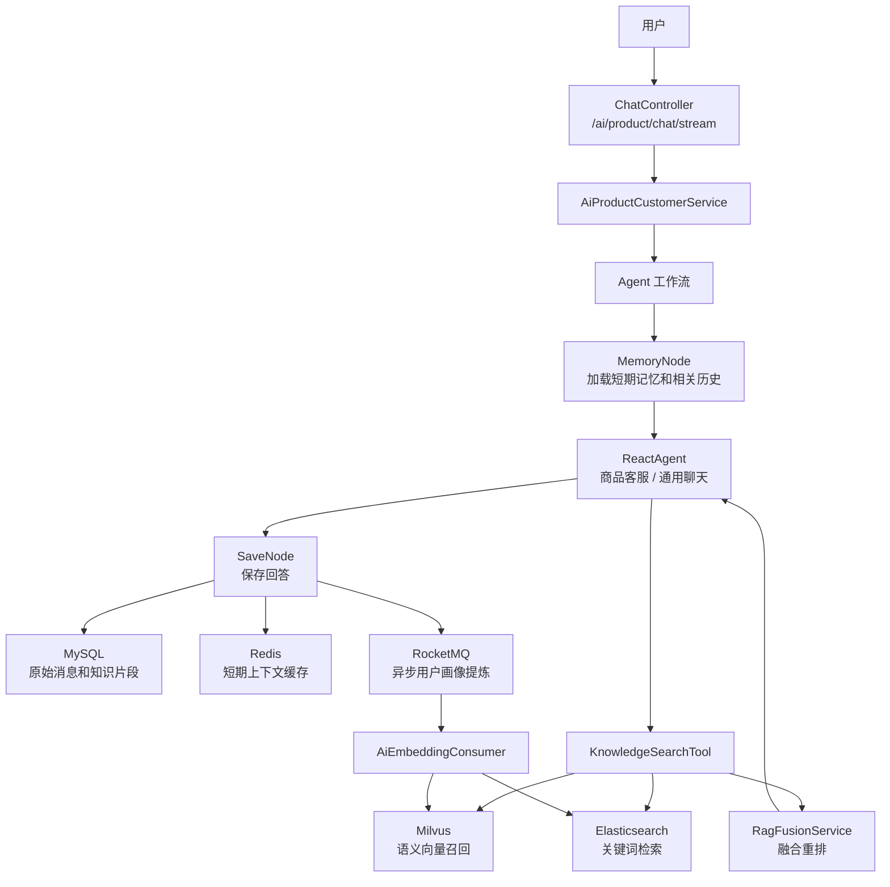
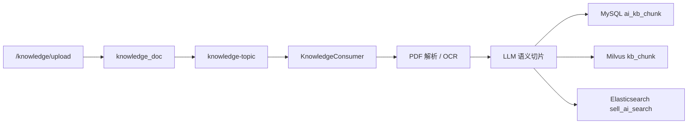

# 电商秒杀系统 AI 智能客服

这是一个基于 Spring Boot 3 + Vue 3 的电商秒杀系统，业务侧包含用户认证、商品管理、购物车、订单、支付宝支付和高并发秒杀；AI 侧重点建设了商品智能客服、知识库 RAG、会话记忆、用户画像和混合检索能力。

项目当前的 AI 检索设计是：Milvus 负责语义向量召回，Elasticsearch 负责 RAG 关键词检索，MySQL 保存原始业务和对话数据，Redis 承载短期上下文缓存，RocketMQ 负责知识库处理和用户画像异步提炼。

## AI 核心能力

- 智能商品客服：通过 `/ai/product/chat/stream` 提供 SSE 流式回答。
- RAG 知识库问答：支持上传 PDF 知识文档，解析、切片、向量化后用于商品、活动、售后政策问答。
- 混合检索：Milvus 做语义检索，Elasticsearch 做关键词/BM25 检索，再通过 `RagFusionService` 融合重排。
- 记忆层更新：短期对话上下文存 Redis/MySQL，相关历史记忆按当前问题从 ES 召回，避免把无关历史塞进上下文。
- 用户画像：每 10 轮对话异步提炼用户偏好摘要，写入 Milvus 和 ES，用于后续个性化响应。
- 人工确认：商品查询工具支持 HITL，在执行敏感工具调用前让用户确认。
- 可引用回答：知识检索结果会携带来源、时间和置信度，回答末尾可生成“参考来源”。

## AI 架构



## RAG 检索流程

1. 用户问题进入 Agent 后，商品、活动、售后相关问题优先调用 `knowledgeSearch`。
2. `KnowledgeSearchTool` 使用 DashScope `text-embedding-v1` 生成查询向量。
3. Milvus 在 `sell.kb_chunk` 中召回语义相近的知识片段。
4. Elasticsearch 在统一索引 `sell_ai_search` 中检索关键词结果。
5. ES 同时检索商品和当前会话的相关历史记忆。
6. `RagFusionService` 按语义分、关键词分、覆盖率、时效性做融合排序。
7. 最终片段写入请求上下文，供大模型回答时引用。

ES 索引采用一个统一索引、多类型字段的方式：

| doc_type | 数据来源 | 用途 |
| --- | --- | --- |
| `knowledge` | `ai_kb_chunk` / Milvus 知识切片 | RAG 知识库关键词召回 |
| `product` | `product` 商品表 | 商品名称、描述、价格、库存等检索 |
| `memory` | `ai_chat_message` / 用户画像摘要 | 会话记忆和用户偏好召回 |

当 Milvus 或 ES 暂时不可用时，系统会降级到 MySQL `LIKE` 检索，保证 AI 问答链路尽量可用。

## 记忆层设计

记忆层分为三类：

| 类型 | 存储 | 说明 |
| --- | --- | --- |
| 短期记忆 | Redis + MySQL | 最近对话文本，Redis TTL 24 小时，MySQL 永久保存 |
| 压缩摘要 | Redis | 当短期上下文超过 Token 阈值时，由 `qwen-turbo` 压缩 |
| 相关历史 | Elasticsearch | 每次根据当前问题动态召回，不写入短期摘要缓存 |

`AiChatMemoryService` 会先加载短期上下文，再按当前问题调用 `ElasticAiSearchService.searchMemory` 召回相关历史。这样既能保留连续对话体验，也能避免长期历史污染当前回答。

## 知识库写入链路



知识库处理步骤：

1. `KnowledgeController` 接收上传文件。
2. `KnowledgeService` 保存文档元信息，并发送 `knowledge-topic` 消息。
3. `KnowledgeConsumer` 下载文件、解析 PDF、调用小模型做语义切片。
4. 每个 chunk 写入 MySQL，并计算 embedding 写入 Milvus。
5. 同步写入 ES，用于关键词召回和重建索引。

## 主要接口

| 接口 | 方法 | 说明 |
| --- | --- | --- |
| `/ai/product/chat/stream` | POST | AI 商品客服流式对话 |
| `/ai/product/chat/history` | GET | 查询指定会话历史 |
| `/knowledge/upload` | POST | 上传知识库文档 |
| `/knowledge/es/rebuild` | POST | 从 MySQL 重建 ES 关键词索引 |

静态测试页面位于：

```text
src/main/resources/static/ai-test.html
```

## 技术栈

后端：

- Spring Boot 3.4.5
- Java 17
- MyBatis Plus
- Redis / Redisson
- RocketMQ
- MySQL
- Elasticsearch
- Milvus
- Spring AI Alibaba Agent Framework
- DashScope `qwen-plus`、`qwen-turbo`、`text-embedding-v1`
- PDFBox、HanLP、MinIO、Alipay SDK

前端：

- Vue 3
- Vite
- Vue Router
- Element Plus
- Axios

## 目录结构

```text
src/main/java/com/example/sell
├── ai              # AI 工具、RAG 检索、ES 索引服务
├── config          # 模型、Agent、Milvus、Redis、Web 等配置
├── consumer        # RocketMQ 消费者
├── controller      # REST API
├── dao             # MyBatis Mapper
├── dto             # 请求 DTO
├── entity          # 数据库实体
├── enums           # 业务枚举
├── node            # Agent 工作流节点
├── scheduler       # 定时任务
├── service         # 业务接口
├── service/impl    # 业务实现
├── utils           # 工具类
└── vo              # 响应 VO
```

## 运行依赖

本地运行前需要准备：

- MySQL，默认库名 `miaosha`
- Redis，默认 `127.0.0.1:6379`
- Elasticsearch，默认 `http://localhost:9200`
- Milvus，默认数据库 `sell`
- RocketMQ NameServer
- DashScope API Key
- Tavily API Key，可用于联网搜索工具

配置集中在：

```text
src/main/resources/application.yml
```

建议把真实密钥改为环境变量或本地私有配置，不要提交到公共仓库。

## 常用命令

后端：

```bash
./mvnw test
./mvnw spring-boot:run
./mvnw clean package -DskipTests
```

前端：

```bash
cd frontend
npm install
npm run dev
```

## AI 相关测试

```bash
./mvnw test -Dtest=ProjectStructureTest,RagFusionServiceTest,MemoryContextAssemblerTest
```

这些测试主要覆盖：

- 包结构是否符合当前分层规范
- 资源文件中是否残留旧包名
- RAG 融合排序逻辑
- 记忆上下文组装逻辑

## 后续优化方向

- 将 DashScope、Tavily、支付宝等密钥全部迁移到环境变量。
- 为 ES 索引增加更精细的中文分词配置。
- 增加 Milvus 和 ES 的集成测试环境。
- 增加用户画像在推荐、商品排序中的实际使用链路。
- 为知识库上传任务增加前端处理进度展示。
